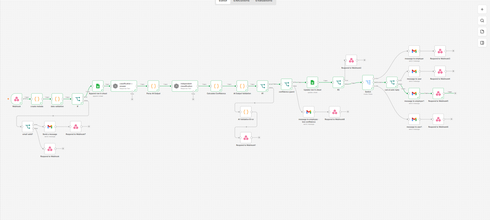
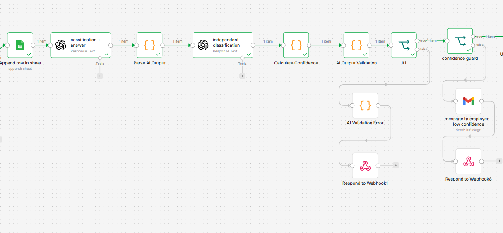
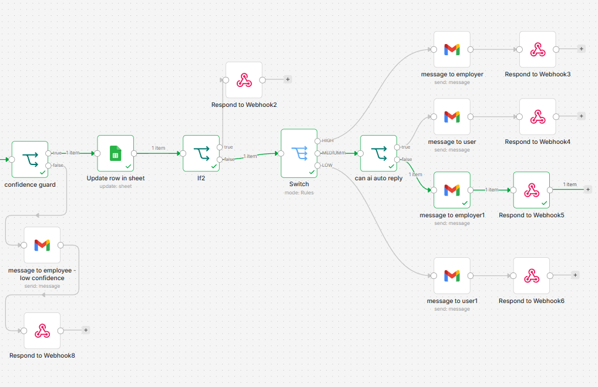
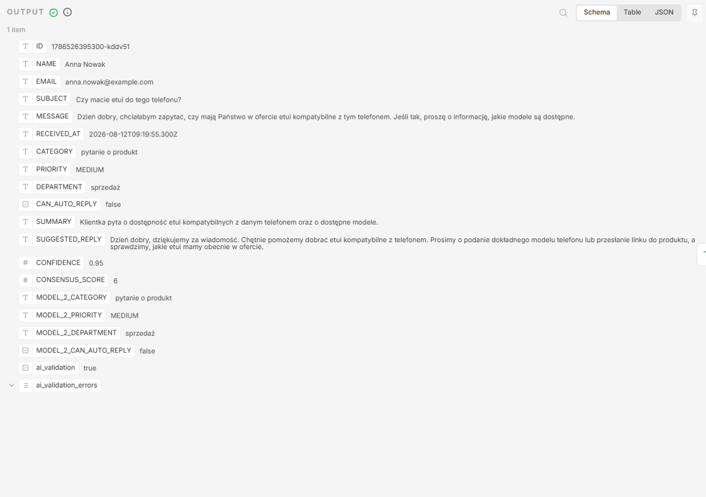

# AI Customer Support Automation

An AI-powered customer support triage and routing system built with **n8n, OpenAI, Webhooks, Google Sheets, Gmail and JavaScript**.

The system analyzes incoming customer messages, validates AI output, independently verifies the classification, calculates a deterministic confidence score, and routes each message according to business rules.

---

## Overview

Customer support teams receive large volumes of messages that require different levels of attention.

This workflow automates the initial triage process:

```text
Customer Message
       ↓
Input Validation
       ↓
AI Classification
       ↓
Independent AI Classification
       ↓
Consensus & Confidence Calculation
       ↓
AI Output Validation
       ↓
Confidence Guard
       ↓
Business Routing
       ↓
┌──────────────┬───────────────┬──────────────┐
│              │               │              │
HIGH         MEDIUM           LOW           SPAM
│              │               │              │
Employee    Employee/User    Customer       Ignored
```

The system is designed to reduce manual triage while preventing uncertain AI decisions from being automatically executed.

---

## Business Problem

A customer support team needs to process incoming messages such as:

- product complaints
- returns
- delivery issues
- invoices
- product questions
- orders
- marketing messages
- business inquiries
- spam

Without automation, employees must manually:

1. read the message,
2. determine its category,
3. determine its priority,
4. decide whether an automatic response is safe,
5. route it to the correct department,
6. prepare a response.

This workflow automates these steps while keeping human review for uncertain or sensitive cases.

---

## Solution

The workflow uses multiple processing and verification layers.

### 1. Input Validation

Incoming webhook data is validated before being processed by the AI.

Invalid input is rejected instead of being passed further into the workflow.

### 2. AI Classification

The first AI model analyzes the customer message and produces structured data containing:

- `CATEGORY`
- `PRIORITY`
- `DEPARTMENT`
- `CAN_AUTO_REPLY`
- `SUMMARY`
- `SUGGESTED_REPLY`
- `CONFIDENCE`

Supported categories:

- `reklamacja`
- `zwrot`
- `dostawa`
- `faktura`
- `marketing`
- `współpraca`
- `zamówienie`
- `pytanie o produkt`
- `spam`

Priority levels:

- `HIGH`
- `MEDIUM`
- `LOW`

Departments:

- `reklamacje`
- `zwroty`
- `dostawa`
- `sprzedaż`
- `zamówienia`
- `księgowość`
- `marketing`
- `współpraca`
- `brak`

### 3. Independent AI Classification

A second AI model independently evaluates the same customer message.

It produces its own classification for:

- category
- priority
- department
- automatic-reply decision

The second model is used as an independent verification layer rather than simply accepting the first model's classification.

### 4. Consensus Calculation

The outputs of the two AI models are compared programmatically.

The workflow calculates a `CONSENSUS_SCORE` based on agreement between the models.

The score ranges from:

```text
0 → 6
```

A higher consensus score indicates stronger agreement between the two model outputs.

### 5. Deterministic Confidence

The workflow does not rely exclusively on the confidence value generated by the LLM.

Instead, confidence is calculated programmatically from the classification results and model agreement.

This makes the confidence mechanism deterministic and easier to control through business rules.

The resulting value is stored as:

```text
CONFIDENCE
```

with a range from:

```text
0.00 → 1.00
```

### 6. AI Output Validation

The AI output is validated before downstream business logic is allowed to use it.

The validation checks:

- allowed categories
- allowed priorities
- allowed departments
- `CAN_AUTO_REPLY` data type
- required `SUMMARY`
- required `SUGGESTED_REPLY`
- `CONFIDENCE` range
- `CONSENSUS_SCORE` range
- Model 2 classification fields

Invalid AI output is rejected and sent through a dedicated error path.

### 7. Confidence Guard

The workflow contains a dedicated confidence guard before normal business routing.

The current threshold is:

```text
CONFIDENCE > 0.79
```

Messages below the threshold do not continue through the normal routing path.

Instead, they are sent to an employee for manual verification.

This prevents uncertain AI decisions from triggering automated business actions.

---

## Business Routing

After successful validation and the confidence check, the message is routed according to its priority and classification.

### HIGH Priority

High-priority messages are routed to an employee.

Typical examples include:

- serious product problems
- urgent delivery problems
- potential financial loss
- escalation risk
- significant customer-impacting issues

```text
HIGH
 ↓
Employee
```

The employee receives the original customer message together with the AI classification and suggested reply.

### MEDIUM Priority

Medium-priority messages are evaluated using:

```text
CAN_AUTO_REPLY
```

Routing:

```text
MEDIUM
   ↓
CAN_AUTO_REPLY?
   ├── true  → Customer
   └── false → Employee
```

This allows the system to automatically answer suitable requests while keeping cases requiring human intervention with an employee.

### LOW Priority

Low-priority messages can be automatically handled when the AI determines that an automatic response is appropriate.

```text
LOW
 ↓
Customer
```

The workflow can send the generated suggested response to the customer.

### SPAM

Spam is handled separately.

```text
SPAM
 ↓
Ignored
```

Spam does not continue through the normal customer-support routing process.

The workflow returns a successful webhook response indicating that the message was ignored.

---

## Human-in-the-Loop

The system intentionally does not attempt to automate every customer interaction.

An employee is involved when:

- confidence is below the configured threshold
- the message requires additional information
- the AI determines that automatic handling is unsafe
- the priority requires human attention

For employee-facing cases, the system provides:

- customer information
- original message
- category
- priority
- department
- summary
- suggested reply
- confidence information

This allows the employee to review and edit the proposed response before sending it.

---

## Safety & Guardrails

The workflow uses several layers of protection instead of trusting a single LLM response.

### Input Validation

Prevents malformed requests from entering the AI pipeline.

### Structured Output Validation

Prevents invalid AI-generated values from being used by business logic.

### Independent AI Verification

A second AI model independently evaluates the classification.

### Consensus Calculation

The two model outputs are compared before the message proceeds.

### Deterministic Confidence

The final confidence value is calculated programmatically rather than blindly trusting an LLM-generated confidence value.

### Confidence Guard

Low-confidence cases are stopped before automated business routing.

### Human Review

Uncertain or sensitive cases are routed to an employee.

### Spam Isolation

Spam is handled separately from normal customer communication.

### Error Handling

Invalid AI output is returned through a dedicated webhook error path instead of being passed into downstream automation.

### Webhook Responses

Terminal workflow paths return a structured response to the system that triggered the webhook.

---

## Architecture

### Workflow Overview



```text
                         ┌─────────────────────┐
                         │   Customer Form     │
                         └──────────┬──────────┘
                                    │
                                    ▼
                         ┌─────────────────────┐
                         │       Webhook       │
                         └──────────┬──────────┘
                                    │
                                    ▼
                         ┌─────────────────────┐
                         │   Input Validation  │
                         └──────────┬──────────┘
                                    │
                                    ▼
                         ┌─────────────────────┐
                         │     AI Model 1      │
                         │ Classification +    │
                         │ Answer Generation   │
                         └──────────┬──────────┘
                                    │
                                    ▼
                         ┌─────────────────────┐
                         │   Parse AI Output   │
                         └──────────┬──────────┘
                                    │
                                    ▼
                         ┌─────────────────────┐
                         │     AI Model 2      │
                         │ Independent         │
                         │ Classification     │
                         └──────────┬──────────┘
                                    │
                                    ▼
                         ┌─────────────────────┐
                         │ Calculate Confidence│
                         │   & Consensus       │
                         └──────────┬──────────┘
                                    │
                                    ▼
                         ┌─────────────────────┐
                         │ AI Output Validation│
                         └──────────┬──────────┘
                                    │
                                    ▼
                         ┌─────────────────────┐
                         │   Confidence Guard  │
                         └──────────┬──────────┘
                                    │
                                    ▼
                         ┌─────────────────────┐
                         │       SPAM?         │
                         └──────────┬──────────┘
                                    │
                         ┌──────────┴──────────┐
                         │                     │
                        YES                    NO
                         │                     │
                         ▼                     ▼
                  Respond Webhook        Priority Router
                                               │
                              ┌────────────────┼────────────────┐
                              │                │                │
                              ▼                ▼                ▼
                            HIGH            MEDIUM             LOW
                              │                │                │
                              ▼                ▼                ▼
                          Employee       Auto Reply?        Customer
                                           │
                                      ┌────┴────┐
                                      │         │
                                     YES        NO
                                      │         │
                                      ▼         ▼
                                   Customer   Employee
```
### Confidence & Validation Engine


       
### Business Routing



---

## End-to-End Workflow

The complete processing sequence is:

1. Receive customer message
2. Validate input
3. Create message metadata
4. Store initial message in Google Sheets
5. Send message to AI Model 1
6. Parse structured AI output
7. Send message to independent AI Model 2
8. Compare model classifications
9. Calculate consensus
10. Calculate deterministic confidence
11. Validate AI output
12. Apply confidence guard
13. Check for spam
14. Route by priority
15. Determine whether automatic reply is allowed
16. Send message to employee or customer
17. Update Google Sheets
18. Return webhook response

---

## Data Flow

The workflow stores and processes structured fields including:

```text
ID
NAME
EMAIL
SUBJECT
MESSAGE
RECEIVED_AT

CATEGORY
PRIORITY
DEPARTMENT
CAN_AUTO_REPLY
SUMMARY
SUGGESTED_REPLY
CONFIDENCE

CONSENSUS_SCORE

MODEL_2_CATEGORY
MODEL_2_PRIORITY
MODEL_2_DEPARTMENT
MODEL_2_CAN_AUTO_REPLY

ai_validation
ai_validation_errors
```

This makes the workflow traceable and easier to debug.

---

## Test Coverage

The workflow was tested against multiple scenarios.

| Test Case | Expected Result | Result |
|---|---|---|
| High-priority complaint | Employee | Passed |
| Medium product question | Employee | Passed |
| Medium automatic-reply case | Customer | Passed |
| Low-priority message | Customer | Passed |
| Low-confidence classification | Manual review | Passed |
| Invalid AI output | Error handling | Passed |
| Invalid input | Validation error | Passed |
| Spam | Ignored | Passed |

### Test Execution


---

## Example Classifications

### Example 1 — High Priority Complaint

```text
Category: reklamacja
Priority: HIGH
Department: reklamacje
CAN_AUTO_REPLY: false
```

Result:

```text
→ Employee
```

The employee receives the customer message and a suggested response.

### Example 2 — Medium Product Question

```text
Category: pytanie o produkt
Priority: MEDIUM
Department: sprzedaż
CAN_AUTO_REPLY: false
```

Result:

```text
→ Employee
```

The system does not automatically respond because employee involvement is required.

### Example 3 — Low Priority

```text
Category: marketing
Priority: LOW
Department: marketing
CAN_AUTO_REPLY: true
```

Result:

```text
→ Customer
```

The generated response can be sent automatically.

### Example 4 — Spam

```text
Category: spam
Priority: LOW
Department: brak
CAN_AUTO_REPLY: false
```

Result:

```text
→ Ignored
```

The system does not forward the message to the employee or customer.

### Example 5 — Low Confidence

```text
CONFIDENCE < 0.80
```

Result:

```text
→ Confidence Guard
→ Employee
```

The case is manually reviewed instead of continuing through normal automated routing.

---

## Technology Stack

- **n8n** — workflow orchestration
- **OpenAI** — AI classification and response generation
- **JavaScript** — deterministic validation and confidence logic
- **Webhooks** — system integration
- **Google Sheets** — message logging and CRM-style storage
- **Gmail** — customer and employee communication
- **JSON** — structured AI output

---

## Project Structure

```text
ai-customer-support-automation/
│
├── workflow/
│   └── customer-support-automation.json
│
└── README.md
```

---

## Setup

### Requirements

- n8n
- OpenAI API credentials
- Google Sheets credentials
- Gmail credentials

### Installation

1. Download the workflow JSON from:
   
   `workflow/customer-support-automation.json`

2. Import the workflow into n8n.

3. Configure your own credentials for:
   
   - OpenAI
   - Google Sheets
   - Gmail

4. Replace environment-specific values such as:
   
   `YOUR_GOOGLE_SHEET_ID`

5. Configure the webhook endpoint.

6. Configure the employee recipient email.

7. Test the workflow using the example messages.

> Credentials and environment-specific identifiers are intentionally excluded from this repository.

---

## Important Configuration

This repository contains a sanitized portfolio version of the workflow.

Before running it in another environment, configure:

- OpenAI credentials
- Google Sheets credentials
- Gmail credentials
- Google Sheet ID
- Employee/support email address
- Webhook endpoint

The workflow should be treated as a template that can be connected to a real customer-support environment.

---

## Design Decisions

### Why use two AI models?

A single LLM classification can produce inconsistent results.

The second model provides an independent classification that can be compared against the first model.

This creates an additional verification layer before automated business actions are executed.

### Why not trust the LLM confidence score?

LLM-generated confidence values should not automatically be treated as calibrated probabilities.

The workflow therefore uses model agreement and deterministic logic to calculate its operational confidence value.

This gives the automation a predictable threshold that can be controlled independently of the model's wording.

### Why use a Confidence Guard?

Automation should become more conservative as uncertainty increases.

The Confidence Guard prevents low-confidence classifications from continuing into the normal automated routing process.

Instead, those cases are escalated for human review.

### Why keep humans in the loop?

Some customer requests require information that the AI does not have access to, such as:

- order status
- account information
- inventory
- transaction details
- customer history
- internal company policies

The system therefore distinguishes between cases that can safely receive an automated response and cases that require an employee.

### Why validate AI output?

An LLM can return unexpected or malformed structured data.

The validation layer prevents invalid values from entering business logic.

This is particularly important when an AI output can trigger external actions such as:

- sending emails
- updating records
- routing customer requests
- generating automated responses

---

## Error Handling

The workflow contains dedicated error paths for invalid input and invalid AI output.

If AI validation fails, the workflow returns structured information containing:

```text
success
error_type
message
validation_errors
request_id
```

This makes failures easier to diagnose and prevents malformed AI output from silently continuing through the workflow.

---

## Automation Philosophy

The workflow follows a simple principle:

```text
Automate when confidence is sufficient.
Escalate when uncertainty is significant.
Never let invalid AI output trigger business actions.
```

The objective is not to remove humans from customer support.

The objective is to allow employees to focus on cases that actually require human judgment.

---

## Portfolio Goals

This project demonstrates practical AI automation engineering concepts:

- workflow orchestration
- LLM integration
- structured AI outputs
- prompt-based classification
- multi-model verification
- deterministic business logic
- confidence and consensus mechanisms
- AI output validation
- human-in-the-loop automation
- error handling
- webhook-based integrations
- external service integration
- automated customer communication
- business process automation

The project focuses on the engineering layer around AI, not only on calling an LLM.

---

## What This Project Demonstrates

From an AI Automation Engineering perspective, the project demonstrates the ability to:

```text
Design
   ↓
Integrate AI
   ↓
Validate AI
   ↓
Verify AI
   ↓
Apply deterministic business logic
   ↓
Control automation risk
   ↓
Route decisions
   ↓
Execute external actions
   ↓
Handle errors
   ↓
Return structured responses
```

This architecture can be adapted to other business processes such as:

- lead qualification
- invoice processing
- email classification
- internal ticket routing
- customer onboarding
- sales automation
- document processing
- support ticket triage

---

## Author

**Michał**

AI Automation Engineer — Portfolio Project

GitHub: `Darkiczweb3`
